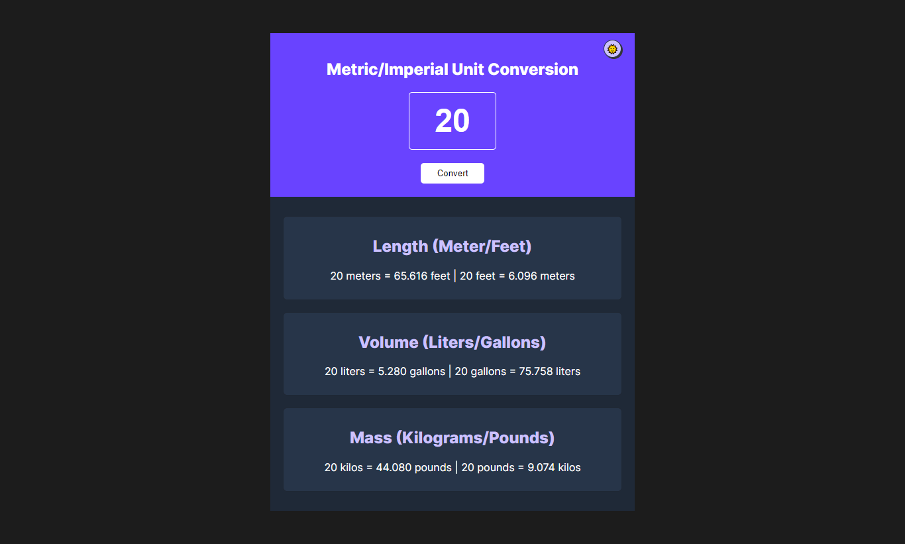
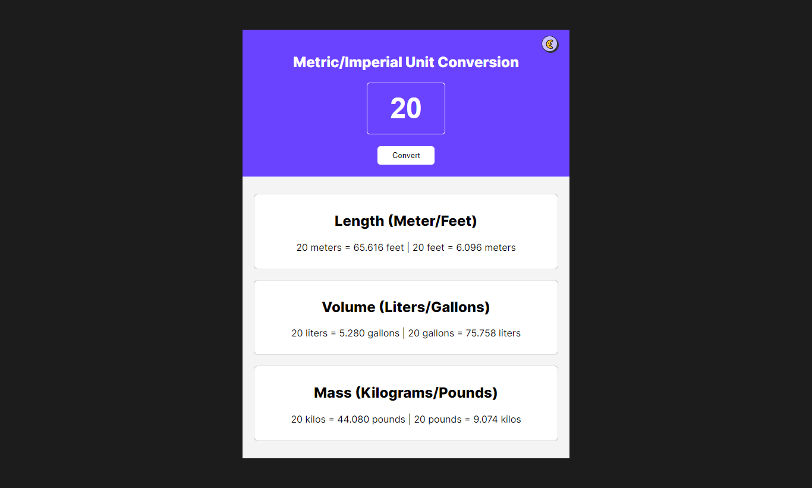

# Scrimba
## Frontend career path
### Making websites interactive - Challenge #3
### Unit Conversor app

A conversor tool for units of length (meters - feet), volume (gallons - liters) and mass (pounds - kilos)

Deploy:
    - https://fast-unit-conversor.netlify.app/

